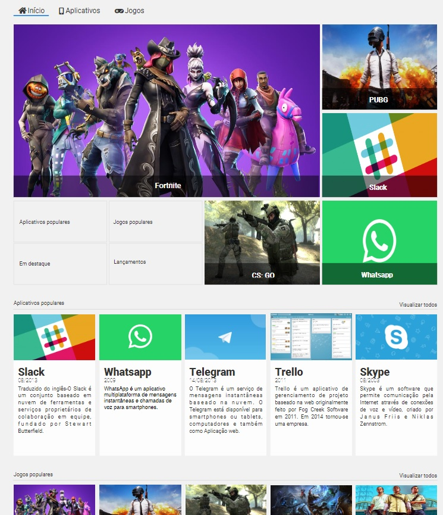

<h1 align="center"> AluraStore </h1>

  

## 🚀 Tecnologias

Esse projeto foi desenvolvido com as seguintes tecnologias:

- HTML e CSS
- Figma
- Git e Github
- BEM ( Block, Element , Modifier)
- Grid Templates

## 💻 Projeto

Alura Store é um layout criado no curso da Alura visando praticar o uso de Grid Templates como  forma de posicionamento dos elementos da pagina , foi utilizado também a metodoligia de arquitetura CSS BEM e responsividade com media queries

- [Acesse o projeto finalizado, online](https://ramonwordads.github.io/AluraStore/)
